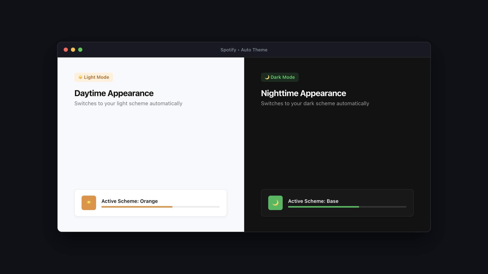

<p align="center">
  <h1 align="center">Auto Theme Switcher</h1>
  <p align="center">
    <strong>Automatic dark and light mode for Spotify. Sub-second switching with zero playback interruption.</strong>
  </p>
  <p align="center">
    <a href="LICENSE"></a>
    
    
    
    
  </p>
</p>

---

<p align="center">
  
</p>

---

Spotify runs in permanent dark mode and offers no native option to follow your system appearance. Even with custom Spicetify themes that include light color schemes, toggling between day and night usually requires manually editing configuration files or reloading the client.

**Auto Theme Switcher** bridges your operating system's appearance with Spotify. The instant your system changes appearance, Spotify adapts seamlessly in real time.

No Spotify reloads. No audio playback interruptions. Under 500ms response time.

---

## ⚡ Features

- **Instant OS Synchronization**: Detects macOS, Windows, and Linux appearance changes and updates the active scheme in under 500ms.
- **Zero Playback Interruption**: Updates colors dynamically in-place via CSS custom properties (`--spice-*`). Music playback is never paused or interrupted.
- **Universal Theme Support**: Compatible with any Spicetify theme—Marketplace themes, community themes, or custom local themes.
- **Built-in Schedule Modes**:
  - **System**: Automatically matches live macOS/OS dark and light mode.
  - **Schedule**: Switches to light scheme during daytime (07:00–19:00) and dark scheme at night.
  - **Custom Hours**: Set your own exact transition hours.
- **Clean In-App Settings**: Dedicated top-bar button (`🌓`) and profile menu entry to configure scheme mappings per theme.
- **Top Bar Quick Toggle**: Click the top bar button to instantly flip between dark and light schemes on the fly.
- **Zero Battery / CPU Drain**: Uses passive macOS system notifications and Chromium media queries. Idles at 0.0% CPU.

---

## 📥 Installation

### Option 1: Spicetify Marketplace (Recommended)

1. Open Spotify and click **Marketplace** in the sidebar.
2. Go to the **Extensions** tab.
3. Search for **Auto Theme Switcher**.
4. Click **Install**.

---

### Option 2: Automated Installer (macOS & Linux)

Run the one-line installer from your terminal:

```bash
git clone https://github.com/hamzamohamedsg/spicetify-auto-theme.git
cd spicetify-auto-theme
./install.sh
```

---

### Option 3: Manual Installation

1. Copy `auto-theme.js` into your Spicetify Extensions directory:
   - **macOS / Linux**: `~/.config/spicetify/Extensions/auto-theme.js`
   - **Windows**: `%appdata%\spicetify\Extensions\auto-theme.js`

2. Enable the extension and apply:
   ```bash
   spicetify config extensions auto-theme.js
   spicetify apply
   ```

---

## ⚙️ Configuration

1. In Spotify, click the **contrast circle icon (`🌓`)** in the top navigation bar (or select **Auto Theme Settings** from your profile menu).
2. Choose your preferred:
   - **Dark Scheme**: e.g., `Base`, `Dark`, `Mocha`
   - **Light Scheme**: e.g., `Orange`, `Light`, `Latte`
   - **Switching Mode**: System, Schedule, or Custom Hours
3. Click **Save & Apply**.

---

## 🧪 Testing

The repository includes a comprehensive unit and integration test suite:

```bash
npm test
```

---

## 📄 License

Auto Theme Switcher is open-source software licensed under the [MIT License](LICENSE).
